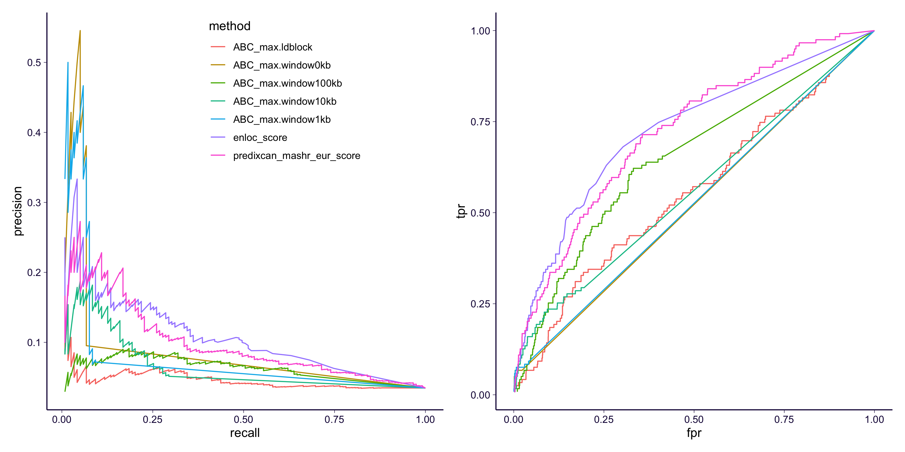
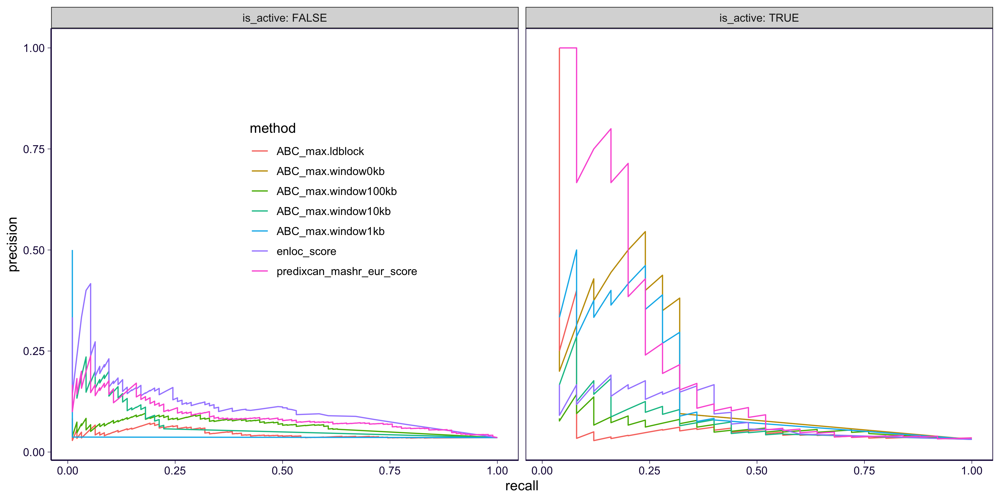
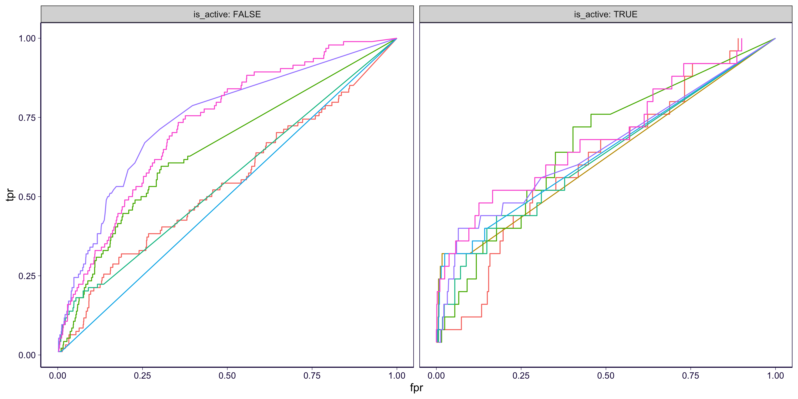
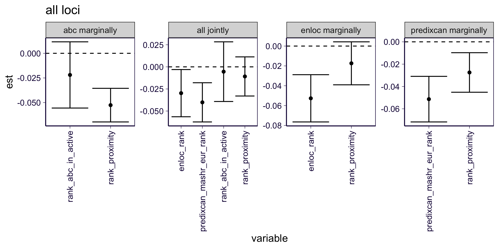
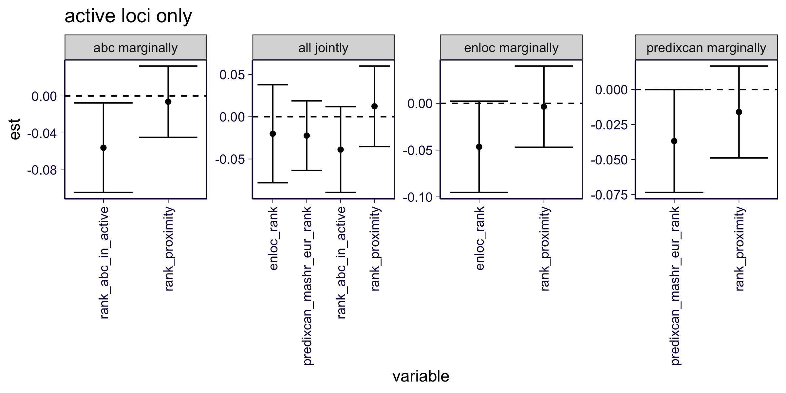

```{r setup}
rm(list = ls())
library(ggplot2)
theme_set(theme_bw(base_size = 12))
library(dplyr)
library(reshape2)
library(data.table)
library(patchwork)
options(stringsAsFactors = FALSE)
library(SilverStandardPerformance)
source('https://gist.githubusercontent.com/liangyy/43912b3ecab5d10c89f9d4b2669871c9/raw/3ca651cfa53ffccb8422f432561138a46e93710f/my_ggplot_theme.R')
source('rlib.R')
```

# Load ABC score table 

Calculated in `../qsub/gwas_abc/`.

```{r}
gene_annot = read.table('https://bitbucket.org/yanyul/rotation-at-imlab/raw/a4ad9182aac280b1e4b84c62b4473acdcb56866a/data/annotations_gencode_v26.tsv', header = T)
df_all = read.table('https://bitbucket.org/yanyul/rotation-at-imlab/raw/a4ad9182aac280b1e4b84c62b4473acdcb56866a/analysis/fdr_power_specificity/companion_figure_finalized/summary_on_expression_cleanup/logistic-based-test.datamatrix-with-gene-info.OMIM-LD-block-PrediXcan-MASH-EUR.tsv', sep = '\t', header = T)

df_abc = list()
types = c('ldblock', 'window0kb', 'window1kb', 'window10kb', 'window100kb')
for(tt in types) {
  df_abc[[tt]] = fread(cmd = paste0('zcat < ~/Desktop/tmp/gwas-abc/gwas_abc/abc_score_table.GTExGWAS-OMIM-', tt, '.tsv.gz'), header = T, sep = '\t', data.table = F)
  df_abc[[tt]] = df_abc[[tt]][!is.na(df_abc[[tt]]$ABC_score), ]
}

abc_yaml = yaml::read_yaml('../simple_enrichment_biosamples.yaml')
```

# Analysis (all traits)

Here we limit the analysis to traits which has enrichment in at least one ABC biosample.
And we annotate the genes with ensembl ID and take the maximum score across all biosamples for each locus/trait/gene tuple.

```{r}
# clean up on traits 
traits_to_include = names(abc_yaml)
traits_to_include = traits_to_include[ traits_to_include %in% df_all$trait ]
df_all_clean = df_all %>% filter(trait %in% traits_to_include)
df_abc_max = list()
df_abc_focused = list()
for(tt in types) {
  # annotate ABC table with ensembl ID
  df_abc[[tt]] = inner_join(df_abc[[tt]], gene_annot %>% select(gene_name, gene_id), by = c('Mapped_gene' = 'gene_name'))
  # obtain ABC-Max score
  df_abc_max[[tt]] = df_abc[[tt]] %>% group_by(snpid, trait, gene_id) %>% summarize(ABC_max = max(ABC_score, na.rm = T)) %>% ungroup()
  # merge all
  df_all_clean = left_join(df_all_clean, df_abc_max[[tt]] %>% select(snpid, trait, gene_id, ABC_max), by = c('lead_var' = 'snpid', 'trait', 'gene' = 'gene_id'))
  new_name = paste0('ABC_max', '.', tt)
  colnames(df_all_clean)[ncol(df_all_clean)] = new_name
  df_all_clean[[new_name]][ is.na(df_all_clean[[new_name]])] = 0
  df_abc_focused[[tt]] = df_all_clean[ paste(df_all_clean$trait, df_all_clean$lead_var) %in% paste(df_abc_max[[tt]]$trait, df_abc_max[[tt]]$snpid), ]
}

```

# ROC and PR curves (including everything)

```{r}
df_score = df_all_clean %>% select(lead_var, trait, gene, is_omim, predixcan_mashr_eur_score, enloc_score, contains("ABC_max"))
# df_score %>% head %>% pander::pander()
df_score = df_score %>% mutate(pair = paste(trait, gene))

# pr and roc all loci
scores = c('predixcan_mashr_eur_score', 'enloc_score', paste0('ABC_max.', types))
coll = list()
coll2 = list()
for(ss in scores) {
  pp = gen_fdr_power_curve(df_score$pair[df_score$is_omim], df_score$pair, df_score[[ss]])
  coll[[length(coll) + 1]] = pp[-nrow(pp), ] %>% mutate(method = ss)
  rr = gen_roc_curve(df_score$pair[df_score$is_omim], df_score$pair, df_score[[ss]])
  coll2[[length(coll2) + 1]] = rr[-nrow(rr), ] %>% mutate(method = ss)
}
df_pr = do.call(rbind, coll)
df_roc = do.call(rbind, coll2)
p1 = df_pr %>% ggplot() + 
  geom_path(aes(x = recall, y = precision, color = method)) + 
  theme(legend.position = c(0.6, 0.8)) +
  th

p2 = df_roc %>% ggplot() + 
  geom_path(aes(x = fpr, y = tpr, color = method)) + 
  theme(legend.position = "none") +
  th

ggsave('../output/abc_in_omim.png', p1 + p2, width = 12, height = 6)
```



**Take-away**:

* For most of the GWAS loci, they do not overlap with active enhancer, that's why the recall is very low when including all GWAS loci.


<!-- ```{r} -->
<!-- # pr and roc loci with active enhancer -->
<!-- scores = c('predixcan_mashr_eur_score', 'enloc_score', paste0('ABC_max.', types)) -->
<!-- coll = list() -->
<!-- coll2 = list() -->
<!-- for(ss in scores) { -->
<!--   if(!is.na(stringr::str_match(ss, 'ABC_max.')[, 1])) { -->
<!--     tt = stringr::str_remove(ss, 'ABC_max.') -->
<!--     tmp = df_abc_focused[[tt]] %>% mutate(pair = paste(trait, gene)) -->
<!--     pp = gen_fdr_power_curve(tmp$pair[tmp$is_omim], tmp$pair, tmp[[ss]]) -->
<!--     coll[[length(coll) + 1]] = pp[-nrow(pp), ] %>% mutate(method = ss) -->
<!--     rr = gen_roc_curve(tmp$pair[tmp$is_omim], tmp$pair, tmp[[ss]]) -->
<!--     coll2[[length(coll2) + 1]] = rr[-nrow(rr), ] %>% mutate(method = ss) -->
<!--   } else { -->
<!--     pp = gen_fdr_power_curve(df_score$pair[df_score$is_omim], df_score$pair, df_score[[ss]]) -->
<!--     coll[[length(coll) + 1]] = pp[-nrow(pp), ] %>% mutate(method = ss) -->
<!--     rr = gen_roc_curve(df_score$pair[df_score$is_omim], df_score$pair, df_score[[ss]]) -->
<!--     coll2[[length(coll2) + 1]] = rr[-nrow(rr), ] %>% mutate(method = ss) -->
<!--   } -->

<!-- } -->
<!-- df_pr = do.call(rbind, coll) -->
<!-- df_roc = do.call(rbind, coll2) -->
<!-- p1 = df_pr %>% ggplot() +  -->
<!--   geom_path(aes(x = recall, y = precision, color = method)) +  -->
<!--   theme(legend.position = c(0.6, 0.8)) + -->
<!--   th; p1 -->

<!-- p2 = df_roc %>% ggplot() +  -->
<!--   geom_path(aes(x = fpr, y = tpr, color = method)) +  -->
<!--   theme(legend.position = "none") + -->
<!--   th; p2 -->

<!-- ggsave('abc_in_omim_active_loci.png', p1 + p2, width = 12, height = 6) -->
<!-- ``` -->


<!-- # Analysis (CD traits) -->

<!-- We further limited the analysis to Crohn's disease (and related ones). -->

<!-- ```{r} -->
<!-- cd_traits = c('IBD.EUR.Inflammatory_Bowel_Disease') -->
<!-- ``` -->

<!-- # Assemble approach -->

<!-- ```{r} -->
<!-- df_work = df_abc_focused$window0kb %>% ungroup() %>% mutate(pair = paste(lead_var, trait), pair2 = paste(trait, gene)) -->
<!-- df_work = df_work %>% group_by(trait, lead_var) %>% mutate(ABC_max.window0kb_percentage = rank(ABC_max.window0kb) / n()) %>% ungroup() -->
<!-- head(df_work) -->
<!-- df_work %>% ggplot() + geom_point(aes(x = predixcan_mashr_eur_percentage, y = ABC_max.window0kb_percentage, color = is_omim), alpha = 0.2) -->
<!-- df_work %>% ggplot() + geom_point(aes(x = predixcan_mashr_eur_score, y = ABC_max.window0kb, color = is_omim), alpha = 0.2) -->
<!-- df_work = df_work %>% mutate( -->
<!--   predixcan_mashr_eur_inv = inv_norm(predixcan_mashr_eur_score),  -->
<!--   ABC_max.window0kb_inv = inv_norm(ABC_max.window0kb)) -->
<!-- df_work %>% ggplot() + geom_point(aes(x = predixcan_mashr_eur_inv, y = ABC_max.window0kb_inv, color = is_omim), alpha = 0.2) -->
<!-- ``` -->

<!-- There are r length(unique(df_work$pair[ df_work$is_omim ])) loci. Each time, hold out one locus and train in the other 24 loci. -->

<!-- ```{r} -->
<!-- loci_list = df_work$pair[df_work$is_omim] -->
<!-- eqn_list = list(predixcan_only = 'predixcan_mashr_eur_score', abc_only = 'ABC_max.window0kb', both = 'predixcan_mashr_eur_score + ABC_max.window0kb') -->

<!-- pval_abc_in_both = c() -->
<!-- coll = list() -->
<!-- for(ll in unique(loci_list)) { -->
<!--   df_now = df_work[ df_work$pair != ll, ] -->
<!--   df_ho = df_work[ df_work$pair == ll, ] -->
<!--   for(eqn in names(eqn_list)) { -->
<!--     mod = glm(as.formula(paste0('is_omim ~ ', eqn_list[[eqn]])), family = binomial(), data = df_now) -->
<!--     pred = predict(mod, df_ho) -->
<!--     rpred = rank(pred) -->
<!--     tmp = data.frame(pred = pred, rank_pred = rpred, is_omim = df_ho$is_omim, trait = df_ho$trait, gene = df_ho$gene) %>% mutate(pair = paste(trait, gene), method = eqn) -->
<!--     coll[[length(coll) + 1]] = tmp -->
<!--     if(eqn == 'both') { -->
<!--       pval_abc_in_both = c(pval_abc_in_both, summary(mod)$coefficients[3, 4]) -->
<!--     } -->
<!--   } -->
<!-- } -->
<!-- df_loo = do.call(rbind, coll) -->


<!-- # predicted score based -->
<!-- pr = list() -->
<!-- roc = list() -->
<!-- for(mm in names(eqn_list)) { -->
<!--   df_loo_sub = df_loo %>% filter(method == mm) -->
<!--   rr = gen_roc_curve(df_loo_sub$pair[df_loo_sub$is_omim], df_loo_sub$pair, df_loo_sub$pred) -->
<!--   roc[[length(roc) + 1]] = rr[-1, ] %>% mutate(method = mm) -->
<!--   pp = gen_fdr_power_curve(df_loo_sub$pair[df_loo_sub$is_omim], df_loo_sub$pair, df_loo_sub$pred) -->
<!--   pr[[length(pr) + 1]] = pp[-nrow(pp), ] %>% mutate(method = mm) -->
<!-- } -->

<!-- rr = gen_roc_curve(df_work$pair2[df_work$is_omim], df_work$pair2, df_work$predixcan_mashr_eur_score) -->
<!-- roc[[length(roc) + 1]] = rr[-1, ] %>% mutate(method = 'predixcan_raw') -->
<!-- pp = gen_fdr_power_curve(df_work$pair2[df_work$is_omim], df_work$pair2, df_work$predixcan_mashr_eur_score) -->
<!-- pr[[length(pr) + 1]] = pp[-nrow(pp), ] %>% mutate(method = 'predixcan_raw') -->

<!-- rr = gen_roc_curve(df_work$pair2[df_work$is_omim], df_work$pair2, df_work$ABC_max.window0kb) -->
<!-- roc[[length(roc) + 1]] = rr[-1, ] %>% mutate(method = 'abc_max_raw') -->
<!-- pp = gen_fdr_power_curve(df_work$pair2[df_work$is_omim], df_work$pair2, df_work$ABC_max.window0kb) -->
<!-- pr[[length(pr) + 1]] = pp[-nrow(pp), ] %>% mutate(method = 'abc_max_raw') -->
<!-- pr = do.call(rbind, pr) -->
<!-- roc = do.call(rbind, roc) -->

<!-- p1 = pr %>% ggplot() +  -->
<!--   geom_path(aes(x = recall, y = precision, color = method)) +  -->
<!--   theme(legend.position = c(0.6, 0.8)) + -->
<!--   th;  -->

<!-- p2 = roc %>% ggplot() +  -->
<!--   geom_path(aes(x = fpr, y = tpr, color = method)) +  -->
<!--   theme(legend.position = "none") + -->
<!--   th; -->
<!-- p1 + p2 -->

<!-- #  -->
<!-- # # rank based  -->
<!-- # rr = gen_roc_curve(df_loo$pair[df_loo$is_omim], df_loo$pair, df_loo$rank_pred, method = 'lt') -->
<!-- # rr = rr[-1, ] -->
<!-- # pp = gen_fdr_power_curve(df_loo$pair[df_loo$is_omim], df_loo$pair, df_loo$rank_pred, method = 'lt') -->
<!-- # pp = pp[-nrow(pp), ] -->
<!-- #  -->
<!-- # p1 = pp %>% ggplot() +  -->
<!-- #   geom_path(aes(x = recall, y = precision)) +  -->
<!-- #   theme(legend.position = c(0.6, 0.8)) + -->
<!-- #   th;  -->
<!-- #  -->
<!-- # p2 = rr %>% ggplot() +  -->
<!-- #   geom_path(aes(x = fpr, y = tpr)) +  -->
<!-- #   theme(legend.position = "none") + -->
<!-- #   th; -->
<!-- # p1 + p2 -->
<!-- ``` -->

# PR/ROC curves (limit to active enhancer only)

```{r}
df_limit = df_abc_focused$window0kb %>% select(gene, lead_var, trait)
df_limit = inner_join(df_limit, df_score, by = c('gene', 'lead_var', 'trait'))

scores = c('predixcan_mashr_eur_score', 'enloc_score', paste0('ABC_max.', types))
coll = list()
coll2 = list()
for(ss in scores) {
  pp = gen_fdr_power_curve(df_limit$pair[df_limit$is_omim], df_limit$pair, df_limit[[ss]])
  coll[[length(coll) + 1]] = pp[-nrow(pp), ] %>% mutate(method = ss)
  rr = gen_roc_curve(df_limit$pair[df_limit$is_omim], df_limit$pair, df_limit[[ss]])
  coll2[[length(coll2) + 1]] = rr[-nrow(rr), ] %>% mutate(method = ss)
}
df_pr = do.call(rbind, coll)
df_roc = do.call(rbind, coll2)
p1 = df_pr %>% ggplot() + 
  geom_path(aes(x = recall, y = precision, color = method)) + 
  theme(legend.position = c(0.6, 0.8)) +
  th

p2 = df_roc %>% ggplot() + 
  geom_path(aes(x = fpr, y = tpr, color = method)) + 
  theme(legend.position = "none") +
  th

ggsave('../output/abc_in_omim_loci_in_enhancer.png', p1 + p2, width = 12, height = 6)
```


**Take-away**:

* For the case GWAS loci do overlap with active enhancer, sometimes the silver standard gene is not implicated. That's why the recall is still not so high in the figure on the left. But when it is implicated, the precision is good.
* On the other hand, PrediXcan has good performance on these GWAS loci which overlap with active enhancer.

# ROC/PR stratified by active/non-active loci

Now, takeing together.

```{r}
df_limit = df_abc_focused$window0kb %>% select(gene, lead_var, trait)
df_score2 = left_join(df_score, df_limit %>% select(gene, lead_var, trait) %>% mutate(is_active = T), by = c('gene', 'lead_var', 'trait'))
df_score2$is_active[is.na(df_score2$is_active)] = FALSE

scores = c('predixcan_mashr_eur_score', 'enloc_score', paste0('ABC_max.', types))
coll = list()
coll2 = list()
for(ss in scores) {
  for(ll in c(T, F)) {
    tmp = df_score2 %>% filter(is_active == ll)
    pp = gen_fdr_power_curve(tmp$pair[tmp$is_omim], tmp$pair, tmp[[ss]])
    coll[[length(coll) + 1]] = pp[-nrow(pp), ] %>% mutate(method = ss, is_active = ll)
    rr = gen_roc_curve(tmp$pair[tmp$is_omim], tmp$pair, tmp[[ss]])
    coll2[[length(coll2) + 1]] = rr[-nrow(rr), ] %>% mutate(method = ss, is_active = ll)
  }
}
df_pr = do.call(rbind, coll)
df_roc = do.call(rbind, coll2)
p1 = df_pr %>% ggplot() + 
  geom_path(aes(x = recall, y = precision, color = method)) + 
  theme(legend.position = c(0.3, 0.6)) +
  facet_wrap(~is_active, labeller = label_both) + 
  th2

p2 = df_roc %>% ggplot() + 
  geom_path(aes(x = fpr, y = tpr, color = method)) + 
  theme(legend.position = "none") +
  facet_wrap(~is_active, labeller = label_both) + 
  th2

ggsave('../output/abc_in_omim_stratified_pr.png', p1, width = 12, height = 6)
ggsave('../output/abc_in_omim_stratified_roc.png', p2, width = 12, height = 6)
```




**Take-away**: 

* In the non-active loci, enloc performs best but it does not perform well among active loci. In contrast, PrediXcan is the opposite.

# Assemble approach (combine PrediXcan, enloc, and ABC scores)

Here we want to combine PrediXcan ranking, enloc ranking, and ABC ranking (within a locus) and see if them have independent contribution. 
Let's focus on the most stringent definition of ABC score, namely window size = 0.
We consider all loci or the ones overlapping with active enhancer.

The non-active locus, rank of ABC score is manully set to 0 which gives `rank_abc_in_active`.
And we introduce another variable to take care of the baseline in non-active loci (`is_active`).
The latter won't be needed when limiting to active loci.

```{r}
df_limit = df_all_clean
df_limit$is_active = 0
df_limit$is_active[ 
  paste(df_limit$lead_var, df_limit$trait) %in% paste(df_abc_focused$window0kb$lead_var, df_abc_focused$window0kb$trait) 
  ] = 1
df_limit = df_limit %>% group_by(trait, lead_var) %>% mutate(rank_abc = rank(-ABC_max.window0kb)) %>% ungroup()
df_limit$rank_abc_in_active = df_limit$rank_abc
df_limit$rank_abc_in_active[df_limit$is_active == 0] = 0


my_logistic = function(ss, df) {
  form = paste0('is_omim ~ ', paste0(ss, collapse = ' + '))
  mod = glm(as.formula(form), family = binomial(), data = df)
  out = as.data.frame(summary(mod)$coefficients)
  out = out[rownames(out) %in% ss, ]
  out$variable = rownames(out)
  colnames(out)[1:4] = c('est', 'se', 'zval', 'pval')
  out
}
# include all loci 
# we consider: 1. joint model; 2. marginal model (always go with proximity)
scores = list(
  abc = c('is_active', 'rank_abc_in_active'), 
  predixcan = 'predixcan_mashr_eur_rank', 
  enloc = 'enloc_rank', 
  proximity = 'rank_proximity'
)
mod_list = list()
mod_list[[length(mod_list) + 1]] = my_logistic(unlist(scores), df_limit) %>% mutate(test = 'all jointly')

for(n in names(scores)) {
  if(n == 'proximity') {
    next
  }
  mod_list[[length(mod_list) + 1]] = my_logistic(c(scores[[n]], scores$proximity), df_limit) %>% mutate(test = paste0(n, ' marginally'))
}
df_all = do.call(rbind, mod_list)
p = df_all %>% filter(variable != 'is_active') %>% 
  ggplot() + geom_point(aes(x = variable, y = est)) + 
  geom_errorbar(aes(x = variable, ymin = est - 1.96 * se, ymax = est + 1.96 * se)) + 
  facet_wrap(~test, scales = 'free', nrow = 1) + 
  geom_hline(yintercept = 0, linetype = 2) +
  theme(axis.text.x = element_text(angle = 90, hjust = 1, vjust = 0.5)) + 
  th2 + ggtitle('all loci')
ggsave('../output/abc_in_omim_logistic_all.png', p, width = 8, height = 4)

# focus on active locus
scores = list(
  abc = 'rank_abc_in_active',  # no need to include is_active anymore 
  predixcan = 'predixcan_mashr_eur_rank', 
  enloc = 'enloc_rank', 
  proximity = 'rank_proximity'
)

df_limit_active = df_limit %>% filter(is_active == 1)

mod_list = list()
mod_list[[length(mod_list) + 1]] = my_logistic(unlist(scores), df_limit_active) %>% mutate(test = 'all jointly')


for(n in names(scores)) {
  if(n == 'proximity') {
    next
  }
  mod_list[[length(mod_list) + 1]] = my_logistic(c(scores[[n]], scores$proximity), df_limit_active) %>% mutate(test = paste0(n, ' marginally'))
}
df_active = do.call(rbind, mod_list)
p = df_active %>% filter(variable != 'is_active') %>% 
  ggplot() + geom_point(aes(x = variable, y = est)) + 
  geom_errorbar(aes(x = variable, ymin = est - 1.96 * se, ymax = est + 1.96 * se)) + 
  facet_wrap(~test, scales = 'free', nrow = 1) + 
  geom_hline(yintercept = 0, linetype = 2) +
  theme(axis.text.x = element_text(angle = 90, hjust = 1, vjust = 0.5)) + 
  th2 + ggtitle('active loci only')
ggsave('../output/abc_in_omim_logistic_active.png', p, width = 8, height = 4)
```






**Take-away**: 

* ABC ranking is significant when limiting to active loci. If not, it is not significant and this could be attributed to the fact that the non-active loci may dilute the signal. When focusing on active loci, ABC ranking is marginally informative but it is not significant when considering all these variables jointly (this may due to lack of samples).


